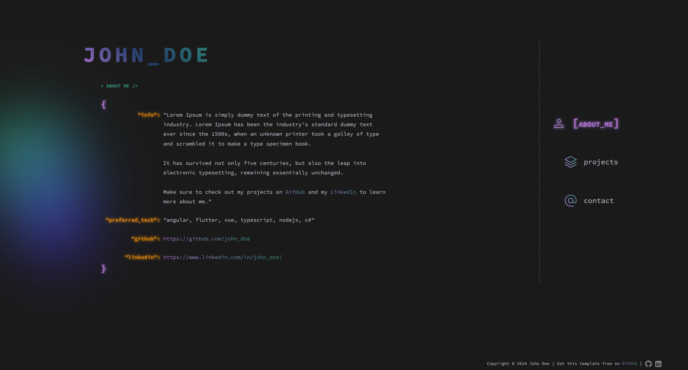
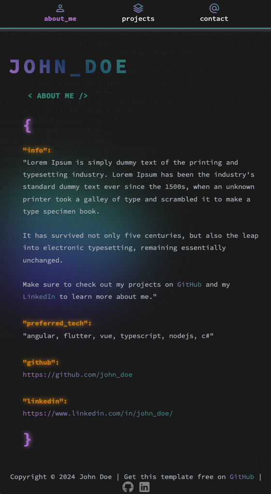

# Coding Theme HTML Template

This HTML template is designed with a coding theme, for developers or tech enthusiasts who want to showcase their personal information in a unique and stylish way.

### Preview

### Desktop

### Mobile

[Live Demo](https://luisvent.com)

### Features

- Stylish coding theme design
- Animated typewriter effect for the title
- Responsive design for multiple devices
- JSON-inspired layout for displaying information
- Material design icons for section navigation
- Gradient background and text effects for added visual appeal

### Usage

1. Clone or download the template from the GitHub repository.
2. Customize the content in the HTML file to reflect your personal information.
3. Modify the stylesheet (`styles.css`) to adjust the appearance as needed.
4. Add your own images, links, and additional sections as desired.

### Structure

- `home.html`: Contains the HTML structure for the About Me page.
- `styles.css`: CSS stylesheet for styling the template.
- `assets`: Directory containing additional resources like fonts and icons.

### Personalization

- Replace the title with your name or desired headline.
- Update the "info" section with a brief description of yourself.
- Modify the "preferred_tech" section to list your preferred technologies.
- Change the links in the "github" and "linkedin" sections to your own profiles.
- Customize the navigation links in the right sidebar to point to other sections of your website.

### Credits

- Fonts: Source Code Pro, Material Symbols Outlined
- Icons: Material Design Icons
- BG Animation: Wil van der Tuin

### License

### FREE TO USE WITH CREDITS

Code HTML Template © 2024 by Luis Ventura is licensed under CC BY 4.0

### About the Author

This template was created by Luis Ventura. Connect with me on [GitHub](https://github.com/luisvent) and [LinkedIn](https://www.linkedin.com/in/luisvent/) to learn more about my projects and professional background.
